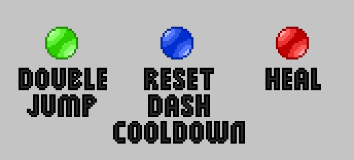
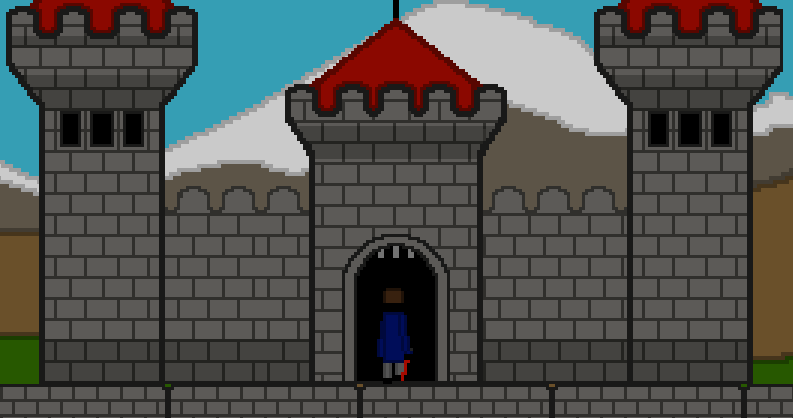

# Platform Game


## Description
Platform Game is a 2D platformer in which the player must navigate to teleporters that take them to the next level. The main goal is to obtain a key to open the final room where the game ends. The player must avoid obstacles and traps that make reaching the goal more difficult. The game also includes items that help the player, such as healing them or allowing them to double jump.

## Features
- Teleporters between levels
- Trap platforms
- Obstacles like spikes, saws
- Two difficulty modes: hardcore and normal
- Multiple environments, including a castle area introduced mid-game 
- Checkpoints (available in non hardcore mode)
- Special balls that help the player  


## Controls
- A / D Move left/right
- Space - Jump
- E - Interact
- Shift - Dash
- Esc - Pause

## Installation

### 1. Clone the repository
```
git clone git@github.com:Rabarbarowy/Platform_Game.git
```

### 2. Install dependencies
```
pip install -r requirements.txt
```
### 3. Start the game
```
python main.py
```

## How to play?
As the player, your goal is to reach the final room. To do this, you must progress through 15 levels using teleports located in levels, find a key to open the final door, and enter the ending area.

After entering the castle, the map changes to a new environment. To progress further, you must find teleporters that take you to the next level.

## Technologies used
- Language - python 3.12.3
- Engine - pygame 2.6.1